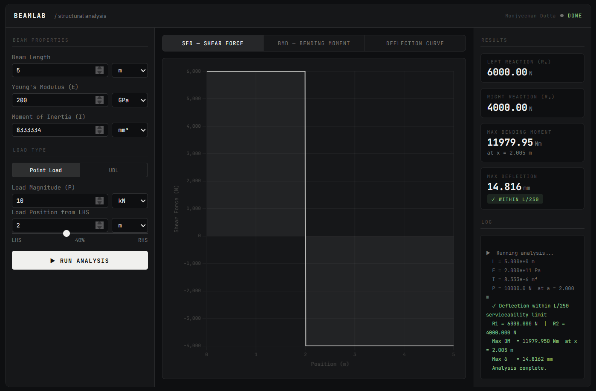
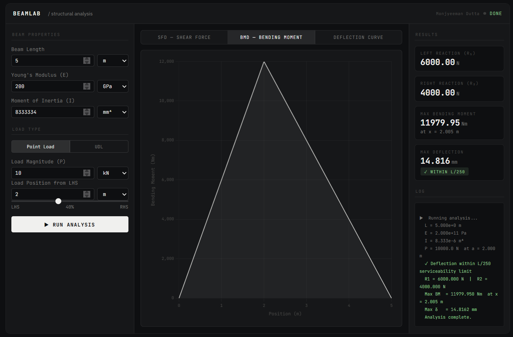
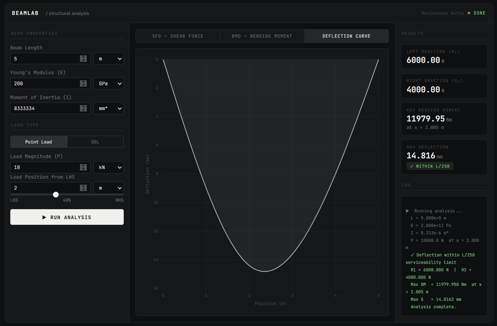

# Beam Analysis Tool

**Developed by:** Monjyeeman Dutta

🔗 **[Live Demo](https://anzai004.github.io/Beam-Analysis-Tool/)**

---

## Overview

The Beam Analysis Tool is a Python-based engineering application for structural analysis of simply supported beams under common loading conditions.

The tool computes reaction forces, generates Shear Force Diagrams (SFD) and Bending Moment Diagrams (BMD), and plots the deflection curve using numerical methods. A browser-based GUI built with Chart.js is also included for interactive use.

---

## Features

- Reaction force calculation
- Shear Force Diagram (SFD)
- Bending Moment Diagram (BMD)
- Deflection curve visualization
- Supports Point Load and Uniformly Distributed Load (UDL)
- Automatic unit conversion to SI
- Input validation safeguards
- Serviceability check using L/250 deflection limit
- Interactive dark-theme GUI (no install required — open in browser)

---

## Technologies Used

- Python
- NumPy
- Matplotlib
- HTML / CSS / JavaScript (GUI)
- Chart.js

---

## Engineering Concepts Applied

- Euler–Bernoulli Beam Theory
- Static Equilibrium
- Load Distribution
- Structural Serviceability Criteria

---

## Sample Output





---

## Example

**Input:**
- Beam Length: 5 m
- E = 200 GPa, I = 8.33 × 10⁶ mm⁴
- Point Load: 10 kN at 2 m from LHS

**Output:**
- R₁ = 6,000 N, R₂ = 4,000 N
- Max Bending Moment = 12,000 Nm at x = 2.000 m
- Max Deflection = 3.835 mm — within L/250 serviceability limit (20 mm)

---

## How to Run

**GUI:** Visit the [live demo](https://anzai004.github.io/Beam-Analysis-Tool/) — no install required.

**Python CLI:**

Install dependencies:

```bash
pip install numpy matplotlib
```

Run the script:

```bash
python beam_analysis_tool.py
```

---

## Extended Work

This tool informed the development of [MechAssist](https://github.com/Anzai004/MechAssist) — a full engineering decision support application integrating ML-based stress classification and machinability prediction.

---

## Why This Project Matters

This tool bridges theoretical mechanics with computational problem-solving, demonstrating early-stage engineering automation and analytical tool development.